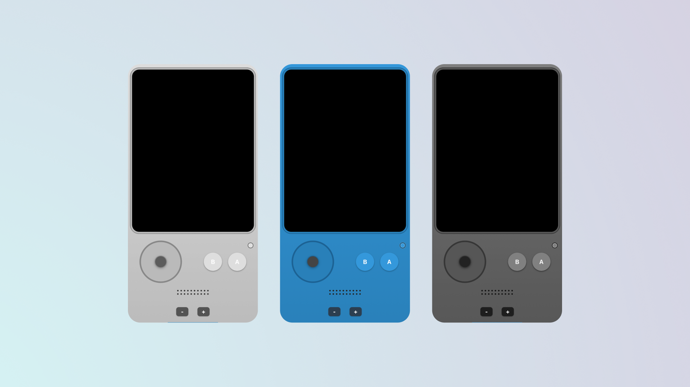

# Pock / PockOS

Pock is a platform currently under development by a single creator.  
It is designed to create a modern, unified environment for powering a wide range of devices — including smartphones, personal computers, gaming PCs, gaming consoles, and more.

PockOS is the secure operating system built using Pock. It focuses on enabling a single codebase to run consistently across all devices, including the web, while maintaining pixel-perfect precision.

---

## About Pock

- **One Codebase Across All Platforms**  
  Develop once and deploy across phones, laptops, consoles, and web browsers without compromise.

- **Pixel-Perfect Design**  
  PockOS guarantees consistent UI and UX across all screen sizes and platforms, including web environments.

- **Designed for a Full Ecosystem**  
  Pock is built to power a complete device lineup, including personal devices, professional computers, and entertainment systems.

- **Integrated Developer Tools**  
  Pock includes:
  - **Pock Simulator**: A real-time simulator for efficient application and system testing.
  - **PockSDK**: An open-source toolkit that combines coding and visual design into a single, seamless workflow, inspired by Xcode, VSCode, and Figma.

- **Security and Stability Focus**  
  PockOS is a closed-source system designed to prioritize device security, system integrity, and stability. Unauthorized modifications and system failures are actively prevented.

---

## Open Source Policy

- **PockOS and Pock Core System**: Closed-source to ensure maximum security and protect system integrity.
- **PockSDK**: Open-source to empower developers with the ability to create applications, extensions, and tools without compromising the core system.

---

## Project Status

Pock and PockOS are currently in active development by a solo developer.  
The platform is experimental and under continuous improvement. Features, structures, and policies may evolve over time.

---

## Vision

Pock and PockOS aim to:

- Simplify the development of secure, high-quality applications and systems across a wide range of devices.
- Guarantee pixel-perfect consistency between native platforms and web.
- Provide a secure, stable operating system environment optimized for modern devices.
- Empower developers with powerful, integrated tools that streamline both design and development workflows.

---

## License

- **PockOS and Pock Core**: All rights reserved.  
- **PockSDK**: Open-source license (specific license details to be announced).

---
